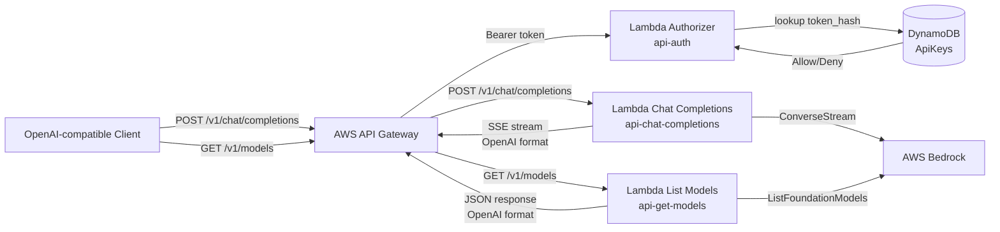

# TMD AI

Serverless OpenAI-compatible proxy to AWS Bedrock. Lets you use any OpenAI-compatible client (e.g., Neovim CodeCompanion, OpenAI SDK) with AWS Bedrock models by translating the OpenAI chat completions format into Bedrock's Converse API.

## Tech Stack

| Layer | Technology |
|---|---|
| Runtime | Rust (edition 2024, workspace) |
| AI Backend | AWS Bedrock (Converse, ConverseStream, ListFoundationModels) |
| Compute | AWS Lambda (ARM64, provided.al2023) with `cargo-lambda` |
| API Gateway | AWS API Gateway V1 (REST) with Token Authorizer |
| Auth Storage | DynamoDB (`ApiKeys` table, keyed by `token_hash`) |
| Infrastructure | AWS CDK v2 + TypeScript + `cargo-lambda-cdk` |

## Architecture



**Request Flow:**

1. Client sends request to API Gateway with `Authorization: Bearer <token>` header
2. API Gateway invokes custom Lambda authorizer (`api-auth`)
3. Authorizer looks up token in DynamoDB `ApiKeys` table
4. If valid, request proceeds to either:
   - `api-chat-completions` for streaming chat completions
   - `api-get-models` for listing available models
5. Lambda function calls AWS Bedrock and transforms response to OpenAI format
6. Response is streamed back to client

## Prerequisites

- **Rust** 1.95+
- **Node.js** + npm
- **AWS CLI** configured with credentials
- **cargo-lambda** — Install with `cargo install cargo-lambda`
- **AWS CDK** — Install with `npm install -g aws-cdk`

## Setup & Deployment

### 1. Clone the repository

```bash
git clone <repository-url>
cd tmd-ai
```

### 2. Install dependencies

```bash
# Install CDK dependencies
cd cdk
npm install
cd ..
```

### 3. Build Rust lambdas

```bash
# Build all lambdas in workspace
cargo build --release

# Or use cargo-lambda for Lambda-specific builds
cargo lambda build --release --arm64
```

### 4. Deploy with CDK

```bash
cd cdk
npm run cdk bootstrap  # First time only
npm run cdk deploy
```

After deployment, note the `TMDAIAPIEndpoint` output value - this is your API base URL.

### 5. Add an API token

See [Token Management](#token-management) below.

## Commands

| Command | Description |
|---|---|
| **CDK** | |
| `npm run build` | Compile CDK TypeScript |
| `npm run cdk deploy` | Deploy infrastructure stack |
| `npm run cdk destroy` | Tear down stack |
| `npm run cdk synth` | Synthesize CloudFormation template |
| `npm run cdk diff` | Show differences from deployed stack |
| **Rust** | |
| `cargo build` | Build all Rust lambdas (debug) |
| `cargo build --release` | Build all Rust lambdas (release) |
| `cargo lambda build --release --arm64` | Build for Lambda ARM64 |
| `cargo lambda invoke <function>` | Invoke function locally |
| `cargo test` | Run tests |
| `cargo clippy` | Lint code |

## Token Management

The API uses a **custom Lambda authorizer** that validates the `Authorization` header against a DynamoDB table.

### Adding a Token

Insert an item into the DynamoDB `ApiKeys` table with:

- **`token_hash`** (String, partition key) — The raw API key value (e.g., `sk-my-secret-key`)
- **`username`** (String) — A friendly identifier for the token owner

#### Using AWS CLI

```bash
# Get the table name from CDK output
TABLE_NAME=$(aws cloudformation describe-stacks \
  --stack-name TmdAIStack \
  --query 'Stacks[0].Outputs[?OutputKey==`ApiKeysTableName`].OutputValue' \
  --output text)

# Add a token
aws dynamodb put-item \
  --table-name $TABLE_NAME \
  --item '{
    "token_hash": {"S": "sk-my-secret-key"},
    "username": {"S": "your-name"}
  }'
```

#### Using AWS Console

1. Open the DynamoDB console
2. Navigate to the `TmdAIStack-ApiKeys...` table
3. Create a new item:
   - `token_hash` (String): `sk-my-secret-key`
   - `username` (String): `your-name`

### Using the Token

Include the token in the `Authorization` header:

```bash
curl -X POST https://your-api-endpoint/v1/chat/completions \
  -H "Authorization: Bearer sk-my-secret-key" \
  -H "Content-Type: application/json" \
  -d '{
    "model": "eu.anthropic.claude-3-5-sonnet-20240620-v1:0",
    "messages": [{"role": "user", "content": "Hello!"}]
  }'
```

## API Endpoints

Base URL: `https://<api-id>.execute-api.<region>.amazonaws.com/prod`

### POST `/v1/chat/completions`

Streams Bedrock chat responses in OpenAI-compatible Server-Sent Events (SSE) format.

#### Request

**Headers:**
- `Authorization: Bearer <token>`
- `Content-Type: application/json`

**Body:**
```json
{
  "model": "eu.anthropic.claude-3-5-sonnet-20240620-v1:0",
  "messages": [
    {
      "role": "system",
      "content": "You are a helpful assistant."
    },
    {
      "role": "user",
      "content": "Hello! How are you?"
    }
  ]
}
```

**Supported Message Roles:**
- `system` — System prompt (concatenated if multiple)
- `user` — User messages
- `assistant` — Assistant messages (for conversation history)

#### Response

Server-Sent Events stream (`text/event-stream`) with chunks in OpenAI format:

```
data: {"id":"chatcmpl-bedrock","object":"chat.completion.chunk","created":1686935002,"choices":[{"index":0,"delta":{"role":"assistant"}}]}

data: {"id":"chatcmpl-bedrock","object":"chat.completion.chunk","created":1686935002,"choices":[{"index":0,"delta":{"content":"Hello"}}]}

data: {"id":"chatcmpl-bedrock","object":"chat.completion.chunk","created":1686935002,"choices":[{"index":0,"delta":{"content":"!"}}]}

data: {"id":"chatcmpl-bedrock","object":"chat.completion.chunk","created":1686935002,"choices":[{"index":0,"delta":{},"finish_reason":"stop"}]}

data: [DONE]
```

#### Finish Reasons

- `stop` — Model finished naturally (EndTurn)
- `length` — Model hit max token limit (MaxTokens)

### GET `/v1/models`

Lists available AWS Bedrock foundation models in OpenAI-compatible format.

#### Request

**Headers:**
- `Authorization: Bearer <token>`

#### Response

```json
{
  "object": "list",
  "data": [
    {
      "id": "eu.anthropic.claude-3-5-sonnet-20240620-v1:0",
      "object": "model",
      "created": 1686935002,
      "owned_by": "anthropic",
      "root": "eu.anthropic.claude-3-5-sonnet-20240620-v1:0",
      "parent": null,
      "permission": [...]
    },
    {
      "id": "eu.amazon.nova-pro-v1:0",
      "object": "model",
      "created": 1686935002,
      "owned_by": "amazon",
      "root": "eu.amazon.nova-pro-v1:0",
      "parent": null,
      "permission": [...]
    }
  ]
}
```

## Usage Examples

### cURL

```bash
# List models
curl https://your-api-endpoint/v1/models \
  -H "Authorization: Bearer sk-my-secret-key"

# Chat completion
curl -N https://your-api-endpoint/v1/chat/completions \
  -H "Authorization: Bearer sk-my-secret-key" \
  -H "Content-Type: application/json" \
  -d '{
    "model": "eu.anthropic.claude-3-5-sonnet-20240620-v1:0",
    "messages": [
      {"role": "user", "content": "Write a haiku about serverless"}
    ]
  }'
```

### Python (OpenAI SDK)

```python
from openai import OpenAI

client = OpenAI(
    base_url="https://your-api-endpoint/v1",
    api_key="sk-my-secret-key"
)

response = client.chat.completions.create(
    model="eu.anthropic.claude-3-5-sonnet-20240620-v1:0",
    messages=[
        {"role": "user", "content": "Hello!"}
    ],
    stream=True
)

for chunk in response:
    if chunk.choices[0].delta.content:
        print(chunk.choices[0].delta.content, end="")
```

### Neovim CodeCompanion

```lua
-- In your Neovim config
require("codecompanion").setup({
  adapters = {
    bedrock = function()
      return require("codecompanion.adapters").extend("openai_compatible", {
        env = {
          url = "https://your-api-endpoint/v1",
          api_key = "sk-my-secret-key",
        },
        schema = {
          model = {
            default = "eu.anthropic.claude-3-5-sonnet-20240620-v1:0",
          },
        },
      })
    end,
  },
  strategies = {
    chat = {
      adapter = "bedrock",
    },
    inline = {
      adapter = "bedrock",
    },
  },
})
```

### opencode

Configure the TMD AI proxy as a provider in your `opencode.json` (project-level) or `~/.config/opencode/config.json` (global):

```json
{
  "provider": {
    "tmd-ai": {
      "npm": "@ai-sdk/openai-compatible",
      "name": "TMD AI (Bedrock)",
      "options": {
        "baseURL": "https://<your-api-id>.execute-api.<region>.amazonaws.com/prod/v1",
        "apiKey": "sk-your-token"
      },
      "models": {
        "deepkseek.v3.2": {
          "name": "Deepseek v3.2"
        },
      }
    }
  }
}
```

**Steps:**

1. Deploy the stack and note your API Gateway endpoint URL
2. Create an API token (see [Token Management](#token-management))
3. Add the provider configuration to your opencode config
4. Reference models using the `tmd-ai/<model-id>` format

**Example agent configuration:**

```json
{
  "agent": {
    "main": {
      "model": "tmd-ai/eu.anthropic.claude-3-5-sonnet-20240620-v1:0"
    },
    "fast": {
      "model": "tmd-ai/eu.anthropic.claude-3-5-haiku-20241022"
    }
  }
}
```

**Finding your API endpoint:**

After deploying with CDK, the endpoint URL is in the stack outputs:

```bash
aws cloudformation describe-stacks \
  --stack-name TmdAIStack \
  --query 'Stacks[0].Outputs[?OutputKey==`TMDAIAPIEndpoint`].OutputValue' \
  --output text
```

### Claude Code

[Claude Code](https://docs.anthropic.com/en/docs/claude-code) is Anthropic's official agentic CLI coding tool. It communicates using the **Anthropic Messages API** format, while TMD AI implements the **OpenAI-compatible** format. Because of this protocol difference, the two are **not directly compatible**.

#### Trying It (Will Not Work)

For reference, if the proxy supported the Anthropic format, configuration would look like:

```bash
export ANTHROPIC_BASE_URL="https://<your-api-id>.execute-api.<region>.amazonaws.com/prod/v1"
export ANTHROPIC_API_KEY="sk-your-token"
export ANTHROPIC_MODEL="eu.anthropic.claude-3-5-sonnet-20240620-v1:0"
claude
```

Or via `~/.claude/settings.json` (global) or `.claude/settings.json` (per-project):

```json
{
  "env": {
    "ANTHROPIC_BASE_URL": "https://<your-api-id>.execute-api.<region>.amazonaws.com/prod/v1",
    "ANTHROPIC_API_KEY": "sk-your-token",
    "ANTHROPIC_MODEL": "eu.anthropic.claude-3-5-sonnet-20240620-v1:0"
  }
}
```

#### Workarounds

| Approach | Description |
|---|---|
| **Translation proxy** | Run a local gateway (e.g. [LiteLLM](https://litellm.ai/), [OpenRouter](https://openrouter.ai/)) that translates Anthropic → OpenAI format and point Claude Code at it |
| **Add Anthropic endpoint** | Extend TMD AI to implement `POST /v1/messages` (Anthropic format) alongside the existing OpenAI endpoints |
| **Use OpenAI-compatible tools** | TMD AI works directly with any tool that supports the OpenAI format — [opencode](#opencode), Neovim CodeCompanion, OpenAI SDK, cURL, etc. |

For now, use the [opencode setup](#opencode) or one of the [usage examples](#usage-examples) above — those work out of the box.

### Claude via Bedrock

This proxy exposes Claude models available in your AWS Bedrock account through an OpenAI-compatible interface.

**Common Claude Model IDs:**

| Model | Bedrock Model ID (EU) | Bedrock Model ID (US) |
|---|---|---|
| Claude 3.5 Sonnet | `eu.anthropic.claude-3-5-sonnet-20240620-v1:0` | `anthropic.claude-3-5-sonnet-20240620-v1:0` |
| Claude 3.5 Haiku | `eu.anthropic.claude-3-5-haiku-20241022` | `anthropic.claude-3-5-haiku-20241022-v1:0` |
| Claude 3 Haiku | `eu.anthropic.claude-3-haiku-20240307-v1:0` | `anthropic.claude-3-haiku-20240307-v1:0` |
| Claude Opus 4.7 | `eu.anthropic.claude-opus-4-7` | Cross-region inference profile |
| Claude Sonnet 4.5 | `eu.anthropic.claude-sonnet-4-5-20250929-v1:0` | Cross-region inference profile |

**Cross-region inference profiles** allow access to models not yet available in your region. Use model IDs without region prefix or with `global.` prefix.

**Requirements:**

1. **Enable model access** in the AWS Bedrock console:
   - Navigate to AWS Bedrock → Model access
   - Request access for Claude models
   - Wait for approval (usually instant for Claude 3.x models)

2. **Verify region availability**:
   - Use `GET /v1/models` endpoint to list available models
   - Model IDs include region prefix (e.g., `eu.`, `us.`, or no prefix for cross-region)

3. **Check quotas**:
   - Bedrock enforces per-model rate limits and quotas
   - View limits in AWS Service Quotas console

**Testing Claude access:**

```bash
# List all available models
curl https://your-api-endpoint/v1/models \
  -H "Authorization: Bearer sk-your-token" | jq '.data[].id'

# Test Claude 3.5 Sonnet
curl -N https://your-api-endpoint/v1/chat/completions \
  -H "Authorization: Bearer sk-your-token" \
  -H "Content-Type: application/json" \
  -d '{
    "model": "eu.anthropic.claude-3-5-sonnet-20240620-v1:0",
    "messages": [
      {"role": "user", "content": "Say hello in JSON format"}
    ]
  }'
```

## Environment Variables

Lambda functions use the following environment variables (set automatically by CDK):

| Variable | Function | Description |
|---|---|---|
| `RUST_LOG` | All | Log level (`info`, `debug`, `trace`) |
| `TABLE_NAME` | `api-auth` | DynamoDB table name for token lookup |

## Project Structure

```
tmd-ai/
├── cdk/                            # CDK infrastructure
│   ├── lib/tmd-ai-stack.ts         # Stack definition
│   ├── bin/tmd-ai.ts               # CDK entry point
│   ├── package.json                # Node dependencies
│   └── cdk.json                    # CDK configuration
├── lambdas/
│   ├── api-auth/                   # Custom Lambda authorizer
│   │   ├── src/
│   │   │   ├── main.rs
│   │   │   └── http_handler/mod.rs # Token validation logic
│   │   └── Cargo.toml
│   ├── api-chat-completions/       # Chat completions proxy
│   │   ├── src/
│   │   │   ├── main.rs
│   │   │   └── http_handler/mod.rs # OpenAI ↔ Bedrock translation
│   │   └── Cargo.toml
│   └── api-get-models/             # List models endpoint
│       ├── src/
│       │   ├── main.rs
│       │   └── http_handler/mod.rs # Model list transformation
│       └── Cargo.toml
├── Cargo.toml                      # Rust workspace root
└── README.md                       # This file
```

## IAM Permissions

The CDK stack configures the following IAM permissions:

### `api-auth` Lambda
- `dynamodb:GetItem` on the `ApiKeys` table

### `api-chat-completions` Lambda
- `bedrock:InvokeModel`
- `bedrock:InvokeModelWithResponseStream`
- `bedrock:Converse`
- `bedrock:ConverseStream`

### `api-get-models` Lambda
- `bedrock:ListFoundationModels`

## Development

### Local Testing

Use `cargo-lambda` to test functions locally:

```bash
# Invoke a function with a test event
cargo lambda invoke api-chat-completions --data-file test-events/chat.json

# Start a local API Gateway
cargo lambda watch
```

### Logging

All Lambda functions use `tracing` for structured logging. Set `RUST_LOG` to control verbosity:

```bash
# In CDK stack (cdk/lib/tmd-ai-stack.ts)
environment: {
  RUST_LOG: 'debug',  // info, debug, trace
}
```

View logs in CloudWatch Logs or stream them:

```bash
aws logs tail /aws/lambda/TmdAIStack-ApiChatCompletionsFunction --follow
```

### Testing Locally

```bash
# Run Rust tests
cargo test

# Run CDK tests
cd cdk && npm test
```

## Troubleshooting

### 401 Unauthorized

- Verify token exists in DynamoDB `ApiKeys` table
- Check the `token_hash` value matches exactly (including `Bearer ` prefix removal)
- Ensure authorizer is properly configured in API Gateway

### 403 Forbidden

- Check Lambda IAM role has required Bedrock permissions
- Verify the model ID is correct and available in your region
- Ensure Bedrock model access is enabled in your AWS account

### Streaming Issues

- API Gateway V1 supports response streaming via `lambda_runtime::streaming`
- Ensure client supports Server-Sent Events (SSE)
- Check that `Content-Type: text/event-stream` is being returned

### Model Not Found

- Run `GET /v1/models` to see available models
- Model IDs are region-specific (e.g., `eu.` prefix for EU regions)
- Enable model access in AWS Bedrock console

## License

MIT
